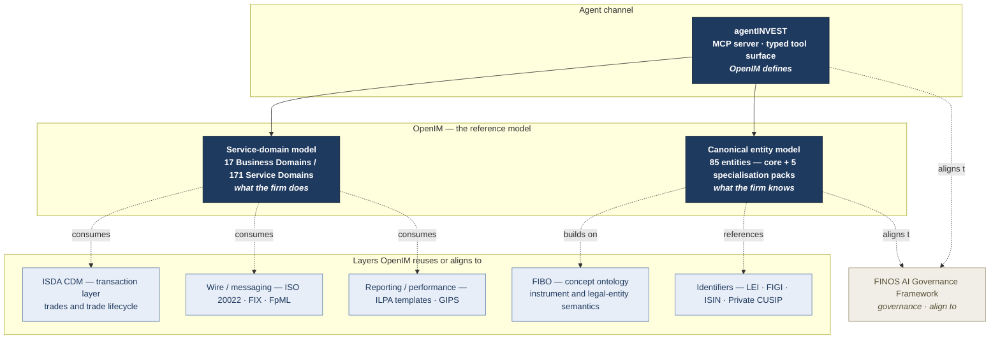

# Layer stack — OpenIM in the standards landscape

OpenIM is a *layer*, and it is honest about which layer. It does not replace [FIBO](https://spec.edmcouncil.org/fibo/), it does not compete with [ISDA CDM](https://www.finos.org/common-domain-model), it is not a wire format. The diagram below shows where OpenIM (and its agent-native reference implementation, **agentINVEST**) sits in relation to the adjacent standards.

The textual rendering of the same picture is in [`../../PRIOR-ART.md`](../../PRIOR-ART.md), with the full explanation of each layer's relationship to OpenIM.

## Reading the diagram

- The **agent channel** (agentINVEST) sits above the model — it is the surface an agent talks to.
- The **model layer** (OpenIM) is the new thing — service-domain decomposition (BD / SD / SO) plus the canonical entity model. This is the part with no existing open equivalent.
- The **layers below** are reused or aligned to. ISDA CDM models trades; OpenIM models the portfolio, fund and mandate *above* the trade. FIBO models the *what* of instruments and legal entities; OpenIM uses FIBO semantics where they cover the concept. ILPA / GIPS are reporting and presentation standards OpenIM consumes or conforms to. The wire formats are interop at the edges.
- The **FINOS AI Governance Framework** is the governance companion OpenIM aligns its agent-channel risk catalogue to, rather than inventing its own.

The full prose statement of each adjacency is in [`../../PRIOR-ART.md`](../../PRIOR-ART.md) — that document is the project's credibility artefact.
