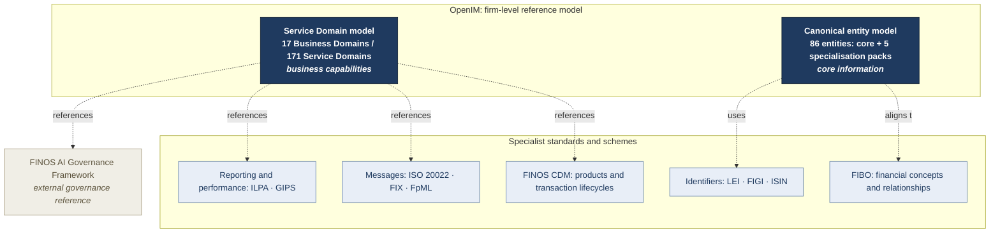

# OpenIM and adjacent model layers

OpenIM is a firm-level reference model. The diagram shows its relationship to specialist standards and identifier schemes. Implementations sit outside the model and remain under their owners' control.

[Related standards and models](../../PRIOR-ART.md) provides the detailed explanation and primary source links.

```mermaid
flowchart TB
    classDef openim   fill:#1f3a5f,stroke:#0e1e33,color:#fff,font-weight:bold
    classDef reuse    fill:#e8eef7,stroke:#5b7aa6,color:#1f3a5f
    classDef govern   fill:#f0eee6,stroke:#a09578,color:#5a513a

    subgraph MODEL[OpenIM: firm-level reference model]
        direction TB
        M1["Service Domain model<br/>17 Business Domains / 171 Service Domains<br/><i>business capabilities</i>"]:::openim
        M2["Canonical entity model<br/>86 entities: core + 5 specialisation packs<br/><i>core information</i>"]:::openim
    end

    subgraph RELATED[Specialist standards and schemes]
        direction TB
        B1["FINOS CDM: products and transaction lifecycles"]:::reuse
        B2["FIBO: financial concepts and relationships"]:::reuse
        B3["Identifiers: LEI · FIGI · ISIN"]:::reuse
        B4["Messages: ISO 20022 · FIX · FpML"]:::reuse
        B5["Reporting and performance: ILPA · GIPS"]:::reuse
    end

    G1["FINOS AI Governance Framework<br/><i>external governance reference</i>"]:::govern

    M1 -.references.-> B1
    M1 -.references.-> B4
    M1 -.references.-> B5
    M2 -.aligns to.-> B2
    M2 -.uses.-> B3
    M1 -.references.-> G1
```

## Reading the diagram

- OpenIM connects a capability map to a canonical entity model.
- FIBO provides financial concepts that OpenIM maps to where the meanings align.
- FINOS CDM provides product and transaction-lifecycle concepts.
- Identifier and message standards operate at integration boundaries.
- ILPA and GIPS provide external reporting or performance rules for relevant capabilities.
- The FINOS AI Governance Framework supplies an external risk and mitigation vocabulary when an implementation uses AI.

See [PRIOR-ART.md](../../PRIOR-ART.md) for the scope and limits of each relationship.
