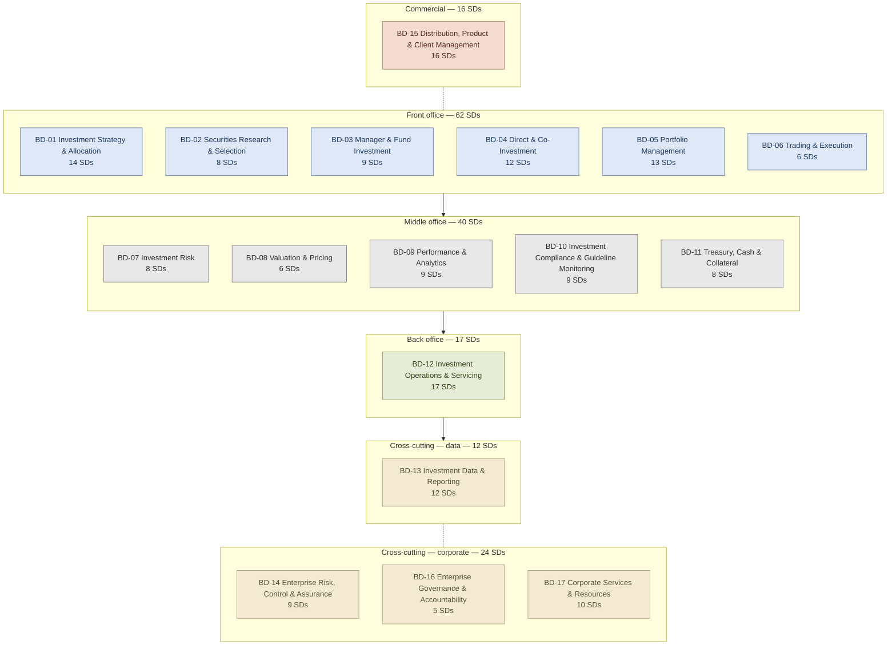

# Business Domain map

The 17 Business Domains of the OpenIM service-domain model, grouped by office tag and labelled with their Service-Domain counts. The graphical companion to the summary table in [`../service-domains/INDEX.md`](../service-domains/INDEX.md).

Office tags are applied at Business-Domain level (not per Service Domain) — several Service Domains span offices, and forcing a per-domain office tag would break non-overlap.

## Reading the diagram

- **Front office** (BD-01 to BD-06) — the investing chain. Strategy and allocation, security and manager research, direct and fund investment, portfolio construction, trade execution. The widest block — six Business Domains, 62 Service Domains — reflecting that the buy-side firm's distinctive activity is investing.
- **Middle office** (BD-07 to BD-11) — control, valuation, measurement, compliance, treasury. The independent functions that price, measure, monitor and fund the front office's positions.
- **Back office** (BD-12) — operations and servicing. The settlements / accounting / corporate-actions backbone. One large Business Domain (17 SDs).
- **Cross-cutting — data** (BD-13) — data, analytics and reporting as a horizontal layer the front and middle offices feed and consume.
- **Cross-cutting — corporate** (BD-14, BD-16, BD-17) — the firm-running capabilities: enterprise risk and assurance, governance and accountability, corporate services.
- **Commercial** (BD-15) — the client and commercial relationship: product, distribution, client management. Dormant for asset-owner archetypes; load-bearing for third-party managers and wealth managers.

Total: **17 Business Domains, 171 Service Domains.**

## What this diagram does not show

The diagram is the office-tagged Business-Domain landscape. It does not show:

- The Service Domains beneath each Business Domain. Drill into each per the links in [`../service-domains/INDEX.md`](../service-domains/INDEX.md).
- The Service Operations beneath each Service Domain (third level, in each SD file).
- Inter-domain dependencies. Many flow from front-office decisions into middle-office checks into back-office settlement; the [ownership map](../ownership-map.md) holds the cross-domain consumes / produces story at entity grain.
- The institution-archetype lens (which Business Domains an asset-owner / asset-manager / wealth-manager / hedge-fund / insurer activates). Recorded in each BD-NN README.
