# Conceptual ERD — core entities

The 38 entities of the [OpenIM core](../entities/INDEX.md), organised in six groups, with the key relationships among them. The specialisation packs ([private-markets](../entities/specialisations/private-markets/README.md), [public-markets](../entities/specialisations/public-markets/README.md), [derivatives](../entities/specialisations/derivatives/README.md), [real-assets](../entities/specialisations/real-assets/README.md)) sit on top of this core — a fund specialises Instrument, a capital call specialises Transaction, a fund NAV specialises Valuation, a direct loan specialises Instrument. This diagram covers only the core; the [attribute-level ERD](d2/core-erd.d2) — every core entity's full column schema, at attribute grain — lives in D2.

The diagram is at **entity-and-relationship grain**, not attribute grain. The attribute-level schema for every core entity lives in its own file under [`../entities/core/`](../entities/core/).

```mermaid
erDiagram

    LEGAL_ENTITY                 ||--o{ INSTRUMENT                : "issues"
    LEGAL_ENTITY                 ||--o{ PORTFOLIO                 : "owns / manages"
    LEGAL_ENTITY                 ||--o{ ENTITY_ALIAS              : "known as"
    LEGAL_ENTITY                 ||--o{ EXTERNAL_IDENTIFIER       : "maps to"

    PORTFOLIO                    ||--o{ PORTFOLIO                 : "parent of (sub-portfolio)"
    PORTFOLIO                    }o--o| ASSET_CLASS               : "asset-class portfolio"
    PORTFOLIO                    ||--o{ HOLDING                   : "contains"
    PORTFOLIO                    ||--o{ TRANSACTION               : "records"
    PORTFOLIO                    ||--o{ CASH_FLOW_EVENT           : "cash in / out"
    PORTFOLIO                    ||--o{ RISK_MEASUREMENT          : "measured by"
    PORTFOLIO                    }o--o{ BENCHMARK_INDEX           : "benchmarked against"

    HOLDING                      }o--|| INSTRUMENT                : "position in"
    HOLDING                      ||--o{ VALUATION                 : "valued by"
    HOLDING                      ||--o{ RISK_MEASUREMENT          : "measured by"

    INSTRUMENT                   }o--|| ASSET_CLASS               : "classified as"
    INSTRUMENT                   ||--o{ ENTITY_ALIAS              : "known as"
    INSTRUMENT                   ||--o{ EXTERNAL_IDENTIFIER       : "maps to"
    INSTRUMENT                   ||--o{ CLASSIFICATION_HISTORY    : "classified by"
    INSTRUMENT                   ||--o{ VALUATION                 : "valued by"

    TRANSACTION                  ||--o{ CASH_FLOW_EVENT           : "generates"
    TRANSACTION                  ||--o{ HOLDING                   : "affects"
    TRANSACTION                  }o--o| LEGAL_ENTITY              : "counterparty"
    TRANSACTION                  }o--o{ DOCUMENT_METADATA         : "evidenced by"

    CASH_FLOW_EVENT              }o--o| INSTRUMENT                : "concerning"

    VALUATION                    }o--o{ PRICE_MARKET_DATA         : "may consume"

    BENCHMARK_INDEX              }o--o{ INSTRUMENT                : "composed of"
    BENCHMARK_INDEX              }o--o| ASSET_CLASS               : "asset-class peer"

    CLASSIFICATION_HISTORY       }o--|| CLASSIFICATION_TYPE       : "uses"

    RISK_MEASUREMENT             }o--o| RISK_LIMIT                : "checked against"
    RISK_MEASUREMENT             }o--o| SCENARIO                  : "computed under"
    RISK_LIMIT                   ||--o{ LIMIT_BREACH              : "breach event"
    LIMIT_BREACH                 }o--|| RISK_MEASUREMENT          : "measurement that crossed"
    LIMIT_BREACH                 }o--|| PORTFOLIO                 : "raised on"

    PERFORMANCE_RESULT           }o--|| PORTFOLIO                 : "return for"
    PERFORMANCE_RESULT           }o--|| METRIC_DEFINITION         : "computed to"
    RISK_MEASUREMENT             }o--|| METRIC_DEFINITION         : "computed to"
    ESG_MEASUREMENT              }o--|| INSTRUMENT                : "about"
    ESG_MEASUREMENT              }o--o| LEGAL_ENTITY              : "about issuer"
    EXTRACTION_RECORD            }o--|| DOCUMENT_METADATA         : "parsed from"
    ESG_COMPLIANCE_RESULT        }o--|| PORTFOLIO                 : "compliance for"
    ESG_COMPLIANCE_RESULT        }o--o{ ESG_MEASUREMENT           : "consumes"
    ESG_COMPLIANCE_RESULT        }o--|| METRIC_DEFINITION         : "computed to"
    INTERNAL_CREDIT_RATING       }o--o| INSTRUMENT                : "rates"
    INTERNAL_CREDIT_RATING       }o--o| LEGAL_ENTITY              : "rates issuer"
    INTERNAL_CREDIT_RATING       }o--|| METRIC_DEFINITION         : "methodology"

    RECONCILIATION_BREAK         }o--|| HOLDING                   : "discrepancy on"
    ACCOUNT                      }o--|| PORTFOLIO                 : "settles through"
    ACCOUNT                      }o--|| LEGAL_ENTITY              : "held by"
    COLLATERAL_POSITION          }o--|| INSTRUMENT                : "asset posted"
    COLLATERAL_POSITION          }o--|| LEGAL_ENTITY              : "counterparty"
    TAX_LOT                      }o--|| LEGAL_ENTITY              : "client"
    TAX_LOT                      }o--|| INSTRUMENT                : "position in"
    TAX_LOT                      }o--|| TRANSACTION               : "acquired by"
    INVESTMENT_AUTHORISATION     }o--o| INSTRUMENT                : "authorises"
    INVESTMENT_AUTHORISATION     }o--|| DOCUMENT_METADATA         : "IC memo"
    COMPLAINT_RECORD             }o--|| LEGAL_ENTITY              : "from client"
    OVERSIGHT_EXCEPTION          }o--|| LEGAL_ENTITY              : "vs administrator"

    LIABILITY_PROFILE            }o--o| PORTFOLIO                 : "strategy target"
    RISK_BUDGET                  }o--|| PORTFOLIO                 : "allocated to"
    ALLOCATION_PLAN              }o--|| PORTFOLIO                 : "governs"
    GOAL                         }o--|| LEGAL_ENTITY              : "client objective"
    GOAL                         }o--o| PORTFOLIO                 : "funded by"
    GOAL_PROGRESS_MEASUREMENT    }o--|| GOAL                      : "measures"
    GOAL_PROGRESS_MEASUREMENT    }o--|| METRIC_DEFINITION         : "computed to"
    FINANCIAL_PLAN               }o--|| LEGAL_ENTITY              : "household"
    FINANCIAL_PLAN               ||--o{ GOAL                      : "contains"
```

## Reading the diagram

The 38-entity core organises into six groups. The Mermaid render above is busy by intent — every cross-group relationship is shown so a reader sees what depends on what. The attribute-level rendering (sql-table form with the full schemas) is at [`d2/core-erd.d2`](d2/core-erd.d2).

### Primary spine (8 entities, E-01 to E-08)

The party / instrument / portfolio / event / valuation axes — the universal core every institutional investor runs over:

- **Legal Entity ([E-01](../entities/core/E-01-legal-entity.md))** — the universal party master. Issuer, counterparty, manager, custodian, administrator, portfolio company, *client*, *borrower* are all *roles* of one Legal Entity, not separate masters.
- **Instrument / Asset ([E-02](../entities/core/E-02-instrument-asset.md))** — the universal holdable thing. Specialised by the four packs (a fund, a listed equity, a derivative, a direct loan, a directly-held real asset).
- **Portfolio / Mandate ([E-03](../entities/core/E-03-portfolio-mandate.md)) → Holding / Position ([E-04](../entities/core/E-04-holding-position.md))** — the container, the positions in it at a point in time. E-04 is key-partitioned by `book` (IBOR vs ABOR).
- **Transaction ([E-05](../entities/core/E-05-transaction.md)) → Cash Flow Event ([E-06](../entities/core/E-06-cash-flow-event.md))** — what happened, with cash consequences.
- **Valuation ([E-07](../entities/core/E-07-valuation.md)) ← Price & Market Data ([E-08](../entities/core/E-08-price-market-data.md))** — a point-in-time value, backed by observable prices or mark-to-model. Append-only. E-07 is key-partitioned by `method`.

### Reference and identity core (7 entities, E-09 to E-15)

The supporting machinery: **Asset Class** (E-09 — nine-class taxonomy), **Benchmark / Index** (E-10), **Classification Type & Value** (E-11) → **Classification History** (E-12, the bi-temporal record), **Entity Alias** (E-13, key-partitioned by master kind), **External Identifier** (E-14, key-partitioned by master kind), **Document Metadata** (E-15).

### Risk core (4 entities, E-16 to E-19)

The artefacts the risk function owns and produces: **Risk Limit** (E-16, the configured threshold), **Scenario** (E-17), **Limit Breach** (E-18, the event when measurement crosses limit), **Risk Measurement** (E-19, the point-in-time measured value, append-only, key-partitioned by `risk_type`).

### Computed-result and metadata core (6 entities, E-20 to E-23 + E-37 + E-38)

Stored, provenance-bearing results — the principle E-07 and E-19 already embody, extended to performance, ESG, parsed manager data, ESG compliance, and credit-rating standing. **Performance Result** (E-20, append-only return figures), **ESG Measurement** (E-21, multi-provider time-series, parallel to E-08), **Metric Definition** (E-22, the governed methodology stored results reference), **Extraction Record** (E-23, parsed-from-document provenance), **ESG Compliance Result** (E-37, SFDR / Taxonomy audit trail), **Internal Credit Rating** (E-38, methodology-versioned standing rating).

### Operational core (7 entities, E-24 to E-26 + E-32 + E-34 to E-36)

The owned, lifecycle-bearing artefacts of the operations and governance functions: **Reconciliation Break** (E-24), **Account** (E-25, key-partitioned by `account_type` — safekeeping vs cash), **Collateral Position** (E-26, the generic posted / received collateral), **Tax Lot** (E-32, per-(client, instrument, acquisition-tranche) record), **Investment Authorisation** (E-34, the IC approval record, co-owned across fund-commitment + direct-investment routes), **Complaint Record** (E-35, FCA DISP regulated record), **Oversight Exception** (E-36, outsourced-administrator oversight evidence).

### Strategy core (6 entities, E-27 to E-31 + E-33)

The objective / target / plan records that allocation and portfolio construction serve: **Liability Profile** (E-27, co-owned across the pension and insurance views — the actuarially-projected liability stream a liability-driven strategy is built against), **Risk Budget** (E-28, allocated to strategy / pod / manager), **Allocation Plan** (E-29, key-partitioned by `plan_type` — strategic / reference-portfolio / commitment-pacing), **Goal** (E-30, the client's demand-side investment objective), **Goal Progress Measurement** (E-31, the append-only per-goal probability-of-meeting-goal), **Financial Plan** (E-33, the versioned multi-year advisory plan that contains the goal hierarchy).

## What this diagram does not show

- **Attributes.** Conceptual layer only; attribute-level schemas live in each entity's file under [`../entities/core/`](../entities/core/). The attribute-level ERD — the same entities at column grain — is at [`d2/core-erd.d2`](d2/core-erd.d2).
- **Specialisations.** The 35 specialisation entities across the four packs (a fund as an Instrument, a capital call as a Transaction, a fund NAV as a Valuation, a directly-held real asset as an Instrument, a direct loan as an Instrument) are in the [pack READMEs](../entities/INDEX.md).
- **Ownership** — which Service Domain owns each entity. That mapping is in [`../ownership-map.md`](../ownership-map.md).
- **Faceted, key-partitioned and co-owned ownership patterns** — ten entities (E-03 faceted; E-04, E-07, E-13, E-14, E-19, E-25, E-29 key-partitioned; E-27 and E-34 co-owned) have multiple co-owning Service Domains under defined patterns. See the ownership map for the full detail.
