# agentINVEST — solution architecture

A technology-named **runtime / deployment view** of agentINVEST, the OpenIM
reference implementation. This is the **solution** view (real tech, real
topology), not the logical BD/SD capability model. The canonical D2 source is
[`agentinvest-solution-architecture.d2`](./agentinvest-solution-architecture.d2);
this Mermaid mirror renders without a `d2` binary.

**Topology vocabulary** is ratified in the project's stack-and-topology decision
record: there is **one orchestrating loop** (the `InvestmentOperation` virtual
object's `.plan()` step). The per-Business-Domain layer is **model-free Restate
*services*, not agents**. The 171 SD / ~1,030 SO decomposition is a **typed tool
catalogue**, not a fleet of reasoning loops.

**Honest current state.** Solid nodes are **BUILT** (exist in `reference/`
today). Dashed nodes are **PLANNED** (decided, not yet built).

## How to read it

- Top to bottom: **callers → surfaces → Restate substrate → agentINVEST runtime → canonical data → observability**.
- The **one reasoning loop** is the orchestrator's `.plan()` step (**BUILT** — `agentinvestPlanner`, Anthropic Sonnet 4.6 structured output, a `PlanSchema`-validated plan journaled exactly once). Everything below it on the agent axis is a model-free **service** or a **tool**, never another loop.
- **BUILT today — the substrate:** the Restate substrate floor (CLI, endpoint, version-skew gate, durable journal); the `InvestmentOperation` virtual object with its full loop — `plan → resolve → dispatch → approve → aggregate → close` — closing end-to-end on the production VO to a real, audited attribution answer, with a full-chain crash-replay proven (the planner not re-called, the tools not re-run, the audit record written once); the `agentinvestPlanner` (the single reasoning loop); the proven cross-language TS→Python typed RPC (`pyTools`); the `argResolver` resolve seam (deterministic, model-free, bounded to the BD-09 return tools — an unresolvable step is a clean failure, never fabricated inputs); the reusable `HighStakesApprovalGate` (a durable `ctx.awakeable` pause — approve → proceed, reject → terminal abort, timeout → terminal abort, all replay-safe); the MCP and OpenAPI ingress; the Operator UI with **all four pages built** — Approvals, Operations, Deployments, and the canonical-data inspector — proven live against the deployed stack; and the hash-chained audit-journal export with its tamper-detecting verifier.
- **BUILT today — the canonical data layer:** the dbt project (staging + bi-temporal intermediate + marts) over realistic synthetic data (3 funds); thirteen typed canonical entities with the schema-drift check; the dual-book (IBOR/ABOR) staging plus the external comparator feeds; and the BD-09 marts (`mart_fund_nav` / `mart_portfolio_holdings` / `mart_performance_appraisal`) carrying the NAV-identity invariant (NAV = gross + accruals − fees).
- **BUILT today — the business workflows:** the **`NavCalculationWorkflow`** — the NAV strike, built and audited end to end: a multi-step journaled durable workflow (load-positions → price → apply-fees → roll-up → publish) with the **human approval gate at the irreversible publish step**, a falsifiable cross-mart reconcile (the gross rolled up independently from `mart_portfolio_holdings` against `mart_fund_nav`'s gross), the NAV identity tied to the published figure, a past-as-of date refused on the wire, and **crash-replay proven** (steps replayed not re-run, publish exactly-once). And the **reconciliation engine (SD-12.10)** — **complete and audited**: the dual-book canonical layer, the `bd12` IBOR/ABOR read services, the deterministic dual-pipeline reconcile (position · cash · transaction-matching · IBOR/ABOR) hosted by the `bd12Recon` service, and the **append-only break store** (engine-owned, insert-only, immutable — no update, no status transition, no delete).
- **The typed tool surface:** 19 tools built — the 5 BD-09 performance/return tools (oracle-tested), the 9 BD-12 IBOR/ABOR read tools, the 4 SD-12.10 reconcile tools, and the original sample tool. The rest of the ~1,030-operation catalogue is PLANNED.
- **PLANNED:** the **propose-only AI stage over unexplained breaks** (designed, not built — explanation proposals only, never a state mutation, never in the truth path); the **state-mutating correction workflow** (not built — the first correcting write to the books, behind the high-stakes approval gate); a production-safe past-as-of NAV strike; a general arg-resolver across the full tool catalogue; ephemeral fan-out subagents; the further per-BD services and the rest of the ~1,030-tool catalogue; the Operator UI's deploy-forward items (app-layer auth, a deploy-step network boundary); the S3/R2 object-lock immutability + the nightly cron for the audit-journal export (the local hash-chained JSON-L export + the tamper-detecting verifier are built — tamper-EVIDENCE); and the Langfuse / Phoenix observability stack.

```mermaid
flowchart TB
  classDef built fill:#1f3a5f,stroke:#0e1e33,color:#ffffff,font-weight:bold;
  classDef builtsoft fill:#dfe8f7,stroke:#5b7aa6,color:#1f3a5f;
  classDef planned fill:#f0eee6,stroke:#a09578,color:#5a513a,stroke-dasharray:5 4;

  subgraph SURF["Channels &amp; surfaces"]
    CLI["agentinvest-cli — TypeScript (tsx)<br/>bootstrap · seed · serve<br/>[BUILT]"]:::built
    MCP["MCP server — stdio sidecar, agent-to-agent<br/>catalogue → MCP descriptors, dispatch to the bd09 / bd12 / bd12Recon services<br/>[BUILT]"]:::builtsoft
    OAPI["OpenAPI surface — programmatic/human<br/>Restate auto-gen 3.1, self-served /openapi.json + /docs<br/>[BUILT]"]:::built
    UI["Operator UI — Next.js + Tailwind (TS)<br/>server-side fetch from admin + ingress · no app-auth (v0.1, single-operator)<br/>approvals (list + approve/reject the gate) · operations (read-only journal + audit record) · deployments · canonical-data inspector<br/>[BUILT — all 4 pages: Approvals + Operations + Deployments + Canonical-data inspector]"]:::builtsoft
  end

  subgraph SUB["Restate — durable-execution substrate"]
    ENG["restate-server — self-hosted single binary<br/>local dev instance (in WSL2 on Windows) · project-owned launcher + pin<br/>admin :9070 · ingress :8080<br/>immutable deployments · version-skew gate<br/>[BUILT — pinned v1.6.2]"]:::built
    JNL["Durable journal — operational audit<br/>sqlite (dev) → Postgres (prod)<br/>[BUILT-by-substrate]"]:::builtsoft
  end

  subgraph RT["agentINVEST runtime — Restate-registered handlers"]
    ORCH["InvestmentOperation — Restate virtual object (keyed by operationId)<br/>TypeScript (Restate TS SDK) · endpoint :9090<br/>SEAMS: plan(BUILT)→resolve(BUILT)→dispatch(BUILT)→approve(BUILT)→aggregate(BUILT)→close(BUILT)<br/>[BUILT — the whole orchestrator loop: version-skew gate + .plan() + arg-resolution + dispatch + approval gate + aggregate + audit-record close]"]:::built
    PLAN["The single reasoning loop — .plan()<br/>agentinvestPlanner (Python) · Anthropic Sonnet 4.6 (forced tool-use)<br/>PlanSchema-validated · journaled exactly once · tool-RAG seam<br/>[BUILT — the one LLM loop]"]:::builtsoft
    GATE["HighStakesApprovalGate — awaitable step (ctx.awakeable durable pause)<br/>riskScore≥threshold → pause · approve/reject/timeout · terminal abort · reusable component<br/>[BUILT — mechanism + forced-fire proof, not wired for read-only by default]"]:::builtsoft
    NAVWF["NavCalculationWorkflow — Restate workflow (keyed per strike) · TypeScript<br/>load-positions → price → apply-fees → roll-up → [GATE] → publish<br/>multi-step journaled · crash-recoverable · publish exactly-once (internal journal)<br/>cross-mart reconcile (holdings ↔ mart_fund_nav gross) + the NAV identity · past-as-of refused on the wire<br/>[BUILT — first real high-stakes gate wiring · synthetic NAV, current-as-of]"]:::builtsoft
    ARGRES["argResolver service — Python · the resolve step's marts-read seam<br/>abstract plan-step args → concrete tool inputs (begin/end NAV · per-segment weights+returns)<br/>reuses the marts→input derivation · journaled · bounded to SO-09-01/05 · unresolvable → clean failure<br/>[BUILT — deterministic, model-free; a general resolver is forward]"]:::builtsoft
    FAN["Ephemeral fan-out subagents<br/>[PLANNED]"]:::planned
    PROPOSE["Propose-only AI stage over unexplained breaks<br/>explanation proposals only · never a state mutation · never in the truth path<br/>[PLANNED — designed, not built]"]:::planned
    CORRECT["Correction workflow — the first state-mutating write<br/>correcting entry to the books behind the high-stakes approval gate<br/>[PLANNED — not built]"]:::planned
    subgraph BDS["Per-Business-Domain layer — model-free Restate SERVICES (not agents)"]
      PY["pyTools service — Python (Restate Python SDK), endpoint :9091<br/>dispatch boundary · no reasoning loop<br/>[BUILT — placeholder + computeSimpleReturn]"]:::built
      PH["agentinvestPlaceholder service — TypeScript<br/>journal-replay proof<br/>[BUILT]"]:::builtsoft
      BDNN["Per-BD model-free services — Python, one per BD<br/>execute_so dispatch + list_capabilities · journaled steps · deterministic-error → TerminalError<br/>[BUILT: bd09 — 5 performance SOs · bd12 — 9 IBOR/ABOR read SOs · further BDs PLANNED]"]:::builtsoft
      RECON["bd12Recon service — the SD-12.10 reconciliation engine<br/>deterministic dual-pipeline reconcile (position · cash · transaction-match · IBOR/ABOR)<br/>reads the internal dual book + the external comparator feeds · deterministic cause classification<br/>appends findings to the break store (insert-only) · no LLM in the truth path<br/>[BUILT — complete and audited]"]:::builtsoft
    end
    TOOLS["Typed tool catalogue — per-Service-Operation functions<br/>Python + Pydantic · 171 SD / ~1,030 SO = tools (not agents)<br/>[BUILT: 19 tools — 5 BD-09 return (oracle-tested) + 9 BD-12 read + 4 SD-12.10 reconcile + 1 sample · the rest of the ~1,030 PLANNED]"]:::builtsoft
  end

  subgraph DATA["Canonical data layer — dbt"]
    SCH["Canonical model schemas — @agentinvest/canonical-model<br/>Python + Pydantic · thirteen canonical entities + drift check<br/>[BUILT]"]:::built
    DBT["dbt project (reference/dbt/) — dbt-duckdb (dev) → dbt-postgres (prod)<br/>staging + intermediate (bi-temporal) + marts BUILT<br/>dual-book (IBOR/ABOR) staging + external comparator feeds BUILT<br/>mart_fund_nav: NAV = Σmv + accruals − fees<br/>[BUILT]"]:::built
    STORE["Canonical store — duckdb (dev; WSL2 ext4 on Windows), keyed per checkout<br/>synthetic seed: 3 funds · bi-temporal as-of history<br/>[BUILT]"]:::builtsoft
    BRK["Append-only break store — E-24 break events<br/>engine-owned duckdb · separate from the canonical store · insert-only, immutable<br/>no update, no status transition, no delete<br/>[BUILT — complete and audited]"]:::builtsoft
  end

  subgraph OBS["Observability &amp; fiduciary audit"]
    LF["Langfuse — LLM-call traces [PLANNED]"]:::planned
    PX["Arize Phoenix — workflow/tool traces [PLANNED]"]:::planned
    EXP["Hash-chained audit-journal export — SHA-256 chain · canonical-JSON · JSON-L + manifest<br/>tamper-detecting verifier (pnpm audit-export / audit-verify) · invokable handler + CLI<br/>[BUILT — local v0.1 (tamper-EVIDENCE) · S3/R2 object-lock + nightly cron PLANNED]"]:::builtsoft
  end

  CLI --> ENG
  MCP -.-> ENG
  OAPI -.-> ENG
  UI -->|ingress — list approvals + resolve the awakeable + read operation state · BUILT| ENG
  UI -.->|admin — list services + the operation journal · BUILT| ENG
  BDNN -->|catalogue → MCP descriptors + dispatch| MCP
  BDNN -->|registered handlers → OpenAPI 3.1| OAPI

  ENG -->|dispatches / replays| ORCH
  ENG -->|dispatches typed RPC| BDS
  ENG -->|journals every step| JNL

  ORCH -->|SEAM 1 plan — journaled once · BUILT+proven| PLAN
  ORCH -->|RESOLVE — abstract args → concrete inputs from the marts · BUILT+proven| ARGRES
  ORCH -->|SEAM 3 gate — durable awakeable pause · no-op for read-only · BUILT+proven| GATE
  ORCH -.->|spawns| FAN
  ORCH -->|SEAM 2 dispatch — Restate typed RPC, BUILT+proven| PY
  ORCH -->|SEAM 2 dispatch — parallel allSettled fan-out · execute_so · BUILT+proven| BDNN
  NAVWF -->|reuses the gate at PUBLISH — first real high-stakes wiring · BUILT+proven| GATE
  NAVWF -->|reads mart_portfolio_holdings + mart_fund_nav via navData · cross-mart NAV reconcile · BUILT+proven| DBT
  ARGRES -->|reads mart_fund_nav + mart_portfolio_holdings · abstract args → concrete tool inputs · BUILT+proven| DBT
  RECON -->|reads the internal dual book + the external comparator feeds · BUILT+proven| DBT
  RECON -->|appends break findings — journaled · insert-only · BUILT+proven| BRK
  PROPOSE -.->|reads unexplained breaks · proposes explanations only| BRK
  CORRECT -.->|the correcting entry rides the high-stakes gate| GATE
  PLAN -->|tool-RAG selects — load-all at the current tool count| TOOLS
  PY -->|hosts / calls| TOOLS

  TOOLS -->|typed over| SCH
  PY -->|reads / writes via dbt| STORE
  SCH -->|shapes Pydantic↔staging| DBT
  DBT -->|materialises| STORE

  PLAN -.->|LLM traces| LF
  ORCH -.->|workflow/tool traces| PX
  JNL -.->|exports hash-chained| EXP
```

